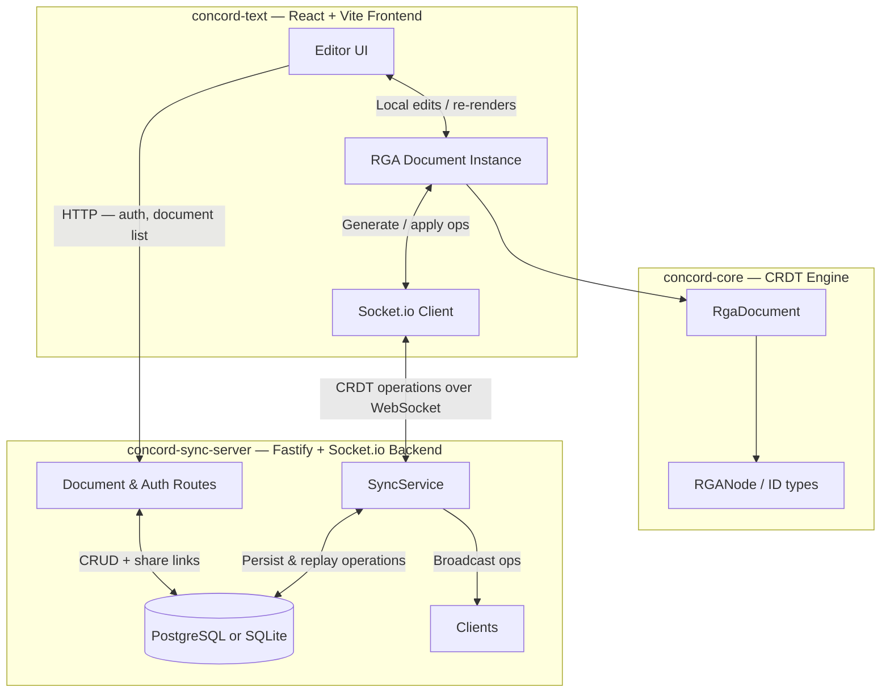

<div align="center">

# Concord

**A local-first, real-time collaborative text editor built on a from-scratch CRDT engine.**

[](https://github.com/himanshusharma-dev-2003/concord/actions/workflows/ci.yml)
[](https://www.typescriptlang.org/)
[](https://nodejs.org/)
[](LICENSE)

</div>

---

Concord lets multiple users edit the same document simultaneously without conflicts. When two users type at the same position at the same time, **both changes are preserved and automatically merged** into a consistent result — on every client, without a central arbitrator.

This is achieved by implementing a **Replicated Growable Array (RGA)**, a well-studied CRDT algorithm, entirely from scratch in TypeScript — no Yjs, no Automerge.

---

## Features

| Feature | Detail |
|---|---|
| **Custom CRDT engine** | RGA implementation with full convergence proofs in the test suite |
| **Real-time sync** | Socket.io-based WebSocket protocol with room-based broadcasting |
| **Presence system** | Live cursor tracking and connected-user avatars per document |
| **JWT authentication** | Signup / login with bcrypt password hashing and signed JWTs |
| **Document sharing** | Generate shareable links with configurable `read` / `edit` permissions |
| **Dual-DB persistence** | PostgreSQL in production; falls back to SQLite (Node built-in) with zero config |
| **Time-travel reconstruction** | Replay any document's operation log to any past timestamp |
| **Monorepo architecture** | pnpm workspaces: CRDT engine, backend, and frontend are independently versioned |
| **Offline-first design** | Operations queue locally and sync when reconnected |

---

## Architecture



### How the CRDT works

Each character in a document is represented as an **RGANode** — a struct carrying a globally unique `(clientId, clock)` ID, the character value, a deletion tombstone flag, and causal origin pointers (left/right neighbours at the time of insertion).

When two clients insert at the same position concurrently, the ordering is resolved deterministically by comparing IDs — **lower `clientId` wins**. This tie-breaker is applied consistently on every peer, so all replicas converge to the same sequence without any server coordination.

Deletions are implemented as **tombstones**: the node is flagged `deleted: true` and remains in the graph. This preserves causal history and makes concurrent insert/delete pairs idempotent.

---

## Tech Stack

| Layer | Technology | Why |
|---|---|---|
| CRDT Engine | TypeScript | Type-safe node graph, easy to test in isolation |
| Backend | Node.js, Fastify | Low overhead, schema-based request validation |
| Real-time | Socket.io | Reliable WebSocket abstraction with room support |
| Auth | JWT + bcryptjs | Stateless, works with WebSocket upgrades |
| Database | PostgreSQL / SQLite | Production-grade with zero-config local fallback |
| Frontend | React 18, Vite | Fast HMR, concurrent rendering |
| Monorepo | pnpm workspaces | Shared packages, single lockfile, fast installs |

---

## Quickstart

```bash
# 1. Install dependencies
pnpm install

# 2. Start both the sync server and the frontend
pnpm dev
```

Open [http://localhost:5173](http://localhost:5173). The sync server starts on port `3001`.

> **No PostgreSQL? No problem.** If `DATABASE_URL` is not set, the server automatically uses a local SQLite database (`crdt_editor.db`). You can be up and running in 30 seconds.

---

## Full Setup

### Prerequisites

- Node.js ≥ 20
- pnpm ≥ 9 (`npm install -g pnpm`)
- PostgreSQL ≥ 14 *(optional — SQLite fallback available)*

### Environment variables

Copy the example file and edit it:

```bash
cp apps/sync-server/.env.example apps/sync-server/.env
```

| Variable | Required | Description |
|---|---|---|
| `DATABASE_URL` | No | PostgreSQL connection string. Omit to use SQLite. |
| `JWT_SECRET` | **Yes in production** | Secret for signing JWTs. Generate: `openssl rand -hex 32` |
| `PORT` | No | Sync server port (default: `3001`) |
| `CORS_ORIGIN` | No | Frontend URL for CORS (default: `*`, development only) |

### Initialize PostgreSQL (optional)

```bash
createdb crdt_editor
psql -U postgres -d crdt_editor -f apps/sync-server/src/persistence/schema.sql
```

### Run tests

```bash
pnpm test
```

The test suite covers 12 cases including formal proofs of the three CRDT convergence properties: **commutativity**, **associativity**, and **idempotence**.

---

## Folder Structure

```
concord/
├── packages/
│   └── core/                    # concord-core: standalone CRDT engine
│       └── src/
│           ├── document.ts      # RgaDocument — insert, delete, merge, toString
│           ├── types.ts         # RGANode, ID, ClientID, Clock
│           ├── utils.ts         # ID comparison and key generation
│           └── document.test.ts # 12 convergence property tests
│
└── apps/
    ├── sync-server/             # concord-sync-server: Fastify + Socket.io backend
    │   └── src/
    │       ├── auth/            # JWT signing and AuthService
    │       ├── middleware/      # requireAuth Fastify preHandler
    │       ├── models/          # Shared TypeScript interfaces
    │       ├── persistence/     # db.ts (pg/sqlite adapter), schema.sql
    │       ├── services/        # DocumentService, REST route handlers
    │       ├── websocket/       # SyncService — Socket.io event handling
    │       └── server.ts        # Fastify app bootstrap
    │
    └── text-editor/             # concord-text: React + Vite frontend
        └── src/
            ├── components/
            │   ├── AuthForm.tsx      # Login / signup form
            │   ├── DocumentList.tsx  # Document grid with create button
            │   └── Editor.tsx        # contenteditable editor + WebSocket sync
            ├── App.tsx
            └── index.css
```

---

## API Overview

Full documentation: [API.md](API.md)

### Authentication

| Method | Endpoint | Description |
|---|---|---|
| `POST` | `/auth/signup` | Register a new user |
| `POST` | `/auth/login` | Authenticate and receive a JWT |

### Documents

| Method | Endpoint | Auth | Description |
|---|---|---|---|
| `GET` | `/documents` | ✅ | List all documents owned by the authenticated user |
| `POST` | `/documents` | ✅ | Create a new document |
| `GET` | `/documents/:id` | ✅ | Get a document (owner or shared access) |
| `POST` | `/documents/:id/share` | ✅ | Generate a shareable link |
| `GET` | `/documents/:id/reconstruct?at=<ISO>` | ✅ | Replay the operation log to a given timestamp |
| `GET` | `/join?token=<token>` | ❌ | Resolve a share link to a document |
| `GET` | `/health` | ❌ | Health check |

### WebSocket events (Socket.io)

| Event (client → server) | Payload | Description |
|---|---|---|
| `join-document` | `{ documentId, clientId }` | Join a document room and receive initial state |
| `crdt-op` | `{ documentId, op: RGANode }` | Broadcast a CRDT operation |
| `cursor-move` | `{ documentId, offset }` | Broadcast cursor position |

| Event (server → client) | Payload | Description |
|---|---|---|
| `initial-state` | `{ snapshot, operations, serverTime }` | Full document state on join |
| `crdt-op` | `{ op, fromClientId }` | Incoming operation from another client |
| `cursor-update` | `{ clientId, offset }` | Another client's cursor moved |
| `presence-sync` | `[{ clientId, socketId }]` | Current room members on join |
| `user-joined` | `{ clientId, socketId }` | New client joined the room |
| `user-left` | `{ clientId, socketId }` | Client disconnected |

---

## Deployment

See [DEPLOYMENT.md](DEPLOYMENT.md) for full instructions.

**Recommended split deployment:**

| Part | Platform | Notes |
|---|---|---|
| `concord-text` (frontend) | Vercel / Netlify | Static Vite build |
| `concord-sync-server` (backend) | Railway / Render / Fly.io | Requires WebSocket support — Vercel serverless does **not** support persistent WebSocket connections |

Set `VITE_API_URL` in the frontend build to point to the deployed sync server URL.

---

## Security

See [SECURITY.md](SECURITY.md) for details.

- Passwords hashed with **bcrypt** (cost factor 10)
- Sessions authenticated via **JWT** (7-day expiry, HS256)
- The server **will warn at startup** if `JWT_SECRET` is the default value in production
- CORS origin is configurable via `CORS_ORIGIN` environment variable

---

## Documentation

| Document | Contents |
|---|---|
| [ARCHITECTURE.md](ARCHITECTURE.md) | CRDT theory, RGA algorithm, sync protocol, persistence model |
| [API.md](API.md) | Full REST and WebSocket API reference |
| [DATABASE.md](DATABASE.md) | Schema, indexes, dual-DB strategy, snapshot compaction |
| [SECURITY.md](SECURITY.md) | Auth model, known limitations, responsible disclosure |
| [CONTRIBUTING.md](CONTRIBUTING.md) | Dev setup, branching, test requirements |
| [ROADMAP.md](ROADMAP.md) | Planned features and engineering improvements |
| [CHANGELOG.md](CHANGELOG.md) | Version history |

---

## Out of Scope (by design)

- **Rich text formatting** — Block-level formatting (bold, headings, embeds) significantly complicates the CRDT mapping and is omitted to keep the engine's convergence guarantees clean and provably correct.
- **Granular access control** — All authenticated users can view and edit all documents they own or have been shared with. Fine-grained ACLs are deferred to keep the sync protocol lightweight and focused on state reconciliation.

---

## Contributing

See [CONTRIBUTING.md](CONTRIBUTING.md). PRs are welcome.

---

## License

[MIT](LICENSE)
